  Concentric Real Time, LLC
  ---------------------------------------------------------------
  NASA Second Generation Beacon Performance Analysis Test Tools

+--------------+
| Reese Bovard |
|              |
| 2-3-2020     |
+--------------+

README
======

NASA OPEN SOURCE AGREEMENT VERSION 1.3

THIS OPEN SOURCE AGREEMENT (\"AGREEMENT\") DEFINES THE RIGHTS OF USE,

REPRODUCTION, DISTRIBUTION, MODIFICATION AND REDISTRIBUTION OF CERTAIN
COMPUTER SOFTWARE ORIGINALLY RELEASED BY THE UNITED STATES GOVERNMENT AS
REPRESENTED BY THE GOVERNMENT AGENCY LISTED BELOW (\"GOVERNMENT
AGENCY\"). THE UNITED STATES GOVERNMENT, AS REPRESENTED BY GOVERNMENT
AGENCY, IS AN INTENDED THIRD-PARTY BENEFICIARY OF ALL SUBSEQUENT
DISTRIBUTIONS OR REDISTRIBUTIONS OF THE SUBJECT SOFTWARE. ANYONE WHO
USES, REPRODUCES, DISTRIBUTES, MODIFIES OR REDISTRIBUTES THE SUBJECT
SOFTWARE, AS DEFINED HEREIN, OR ANY PART THEREOF, IS, BY THAT ACTION,
ACCEPTING IN FULL THE RESPONSIBILITIES AND OBLIGATIONS CONTAINED IN

THIS AGREEMENT.

Government Agency: NASA

Government Agency Original Software Designation: GSC-18375-1

Government Agency Original Software Title: Second Generation Beacon
Performance Analysis Test Tools

User Registration Requested. Please Visit https://software.nasa.gov/

Government Agency Point of Contact for Original Software: David Watson,
david.w.watson-1\@nasa.gov

This is the release of the NASA T21 tools. Create a development
directory where you wish to save the files.

Extract the files into the chosen directory. After extracting the files,
run the top level file \"doit.m\",

It will process an example file \"testburst.mat\" and produce the
results: figures and excel measurements.

Once you have collected your own burst files of the format described in
the document \"T21 Signal Processing Scripts

Description\_Release02032020.docx\" you are ready to configure the
scripts to process.

Open the file doit.m

modify the variable \"xdir\" and point it to the path where your
collected files reside.

For example:

xdir = \'c:\\mypath\';

where files with the extension \'\*.mat\' may be found.

If there is known attenuation in the receive path to the test equipment,
you can account for this by modifying the

variable \"pcal\".

For example, if a 20dB attenuator is placed between the beacon and test
equipment, set pcal:

pcal=20;

Now when the power is measured it will reflect the EIRP of the beacon.

Once the script is modified with your path and power calibration inputs,
save the script and run.

The scripts will read all of the mat files and process them.
Subdirectories will be created in the xdir path

each of which contains the images of the measurements made on the burst.
In addition excel files will be generated

that contain the measurements and burst message payload.

Enjoy

Reese Bovard

Concentric Real Time, LLC

Introduction
============

The following paragraphs map the NASA software to the T21 type approval
standard. Please refer to Figure 2: Processing Steps from T21; each of
the steps will be described in this document.

NASA developed tests to evaluate the performance of the Second
Generation Beacons. NASA has shared the software components and improved
them collaboratively with EPG.

The collection of the burst data from an SGB will be done by testing
authority. The test equipment will be configured to collect the bursts
at 406.05MHz and output samples at baseband. The burst data will be
sampled at a minimum of 153.6kHz complex (4x chip rate).

At the NASA SARLab, the hardware used to collect SGB Burst data is a
Tektronix RSA 6100. The collection the process is illustrated in Figure
1: Acquisition.

The processing software environment is Matlab, which calls Scripts and
C/C++/C\# assemblies (accessed via Matlab).

Figure 1: Acquisition

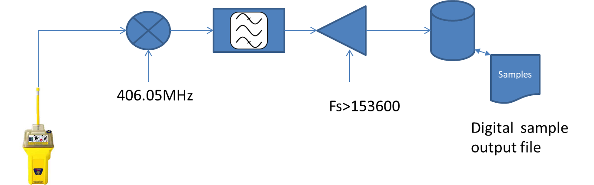{width="6.628472222222222in"
height="2.072187226596675in"}

The collected samples must be read into double precision floating point
complex values. The center frequency of analog to digital conversion
sampled data is presumed to close to 0Hz. The input file will be
resampled to an integral number of samples per chip, assuming the chip
rate of 38400 chips per second.

Figure 2: Processing Steps from T21

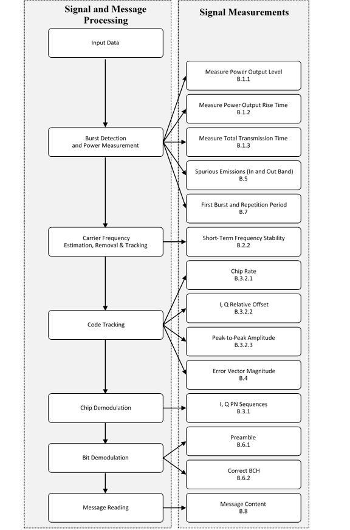{width="5.326407480314961in"
height="8.063888888888888in"}

T21 Mapping
===========

Input Data
----------

The beacon signal is first frequency downconverted using a fixed local
oscillator frequency to an intermediate frequency compatible with an
analog to digital converter. The signal is then sampled by the converter
to produce digital samples of the beacon burst. This can be accomplished
using signal capturing hardware such as a digital spectrum analyzer or
digital oscilloscope. The sampling requirements are:

1.  The digital samples have sufficient amplitude resolution to produce
    accurate measurements;

2.  The sample rate be chosen by the Nyquist bandwidth of the signal
    with margin for carrier offset and unsuppressed out of band RF
    energy that would alias into the frequency band being analysed; and

3.  The sample clock is adequately stable and accurate to produce
    accurate measurements.

The input samples can be either real or complex data. The acquisition of
the signal involves frequency downconversion of the signal to an
intermediate frequency that may cause spectral inversion of the signal's
in-phase (I) and quadrature-phase (Q) components.

### Script doit.m

The script doit.m is the top-level script that manages input files,
passes IQ samples to the processing scripts and saves the results. The
input file format is the matlab ".mat" format that can be read by using
the load command. The output of a realtime spectrum analyser is a ".mat"
file that contains a workspace including the samples in single floating
point format variable "Y" and the sampling interval "XDelta". The input
samples are converted to double precision and the sampling frequency is
derived by inverting the interval.

The script that does the majority of process "get\_payload.m" is called
with the samples, sample frequency, power calibration value and matched
filter Boolean as arguments. The following paragraphs cover the
processing in the get\_payload.m script.

Burst Detection and Power Measurement
-------------------------------------

The beginning of the burst can be detected using an energy detection
approach that can find the rise of the signal envelope. The signal can
be detected by comparing the input samples magnitude to a minimum
threshold crossing. Figure 3: Burst Energy Detection, illustrates the
energy envelope of the signal power output from the acquisition system.
The first instance of the power reaching a minimum threshold will
provide a coarse detection time. A margin of time (Δt) is recommended to
ensure that the beginning of the burst is captured (see Figure 4: Burst
Detection Threshold and Margin). The transmitter output power
measurements can be taken from this power envelope as described in
Section B.1.1.

A spectral measurement of the detected signal is performed. The
normalized power spectral density is then compared to the spurious
emission mask and the out of band power is measured and compared to the
1% threshold as described in Section B.5.

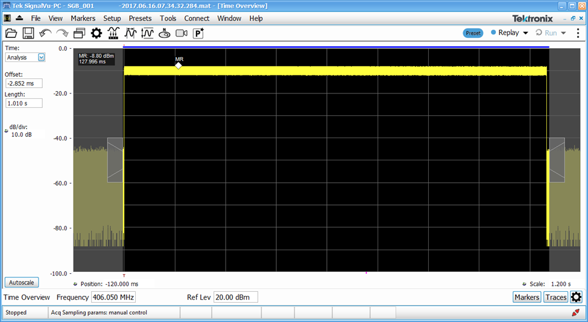{width="6.5in"
height="3.5597222222222222in"}

Figure 3: Burst Energy Detection

{width="6.5in"
height="4.429861111111111in"}

Figure 4: Burst Detection Threshold and Margin

### Scripts frequencydiscover.m and burstdetection.m

The script frequencydiscover.m calculates the frequency and amplitude of
the underlying carrier signal using the forth power followed by FFT. The
signal is windowed so the power over time and frequency over time can be
tracked. The process will collapse the spread power into a single tone
frequency and amplitude. The IQ time domain amplitude is in volts, so
given the 50ohm coupling, the power can be calculated provided one
accounts for attenuation prior to input. This attenuation value is an
input to the getpayload script as the power calibration value; see
Figure 5: Frequency Discover.

The script burstdetection.m uses the power and frequency vectors
generated in frequencydiscover.m. Burst detection uses a statistical
process to find the signal power rise that exceeds a threshold value.
The burst detection process is merely an estimate of the burst start, so
further processing is necessary to find alignment with the locally
generated PN code. Having the burst start estimate will speed the more
processing intensive follow on processing by eliminating unnecessary
delay samples obtained during the trigger/acquisition process, see
Figure 6: Burst Detection.

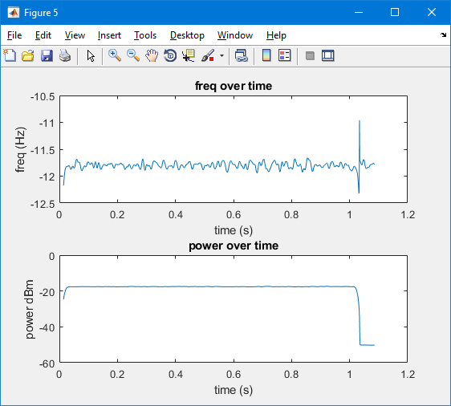{width="6.471014873140858in"
height="4.949305555555555in"}

Figure 5: Frequency Discover

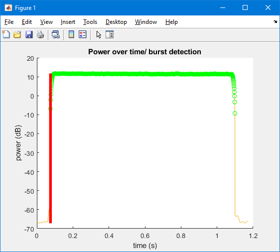{width="5.854166666666667in"
height="5.270833333333333in"}

Figure 6: Burst Detection

### Scripts risetime.m and falltime.m

Using a statistical clustering process to determine the high and low
samples, the 10% and 90% power levels are established for both the start
and end of the burst. The resulting 90% power timestamps are used to
determine the duration of the signal.

Figure 7: Rise Time

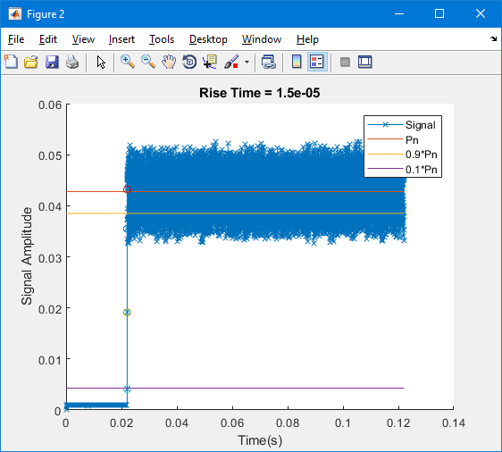{width="4.416666666666667in"
height="3.9765715223097113in"}

Figure 8: Fall Time

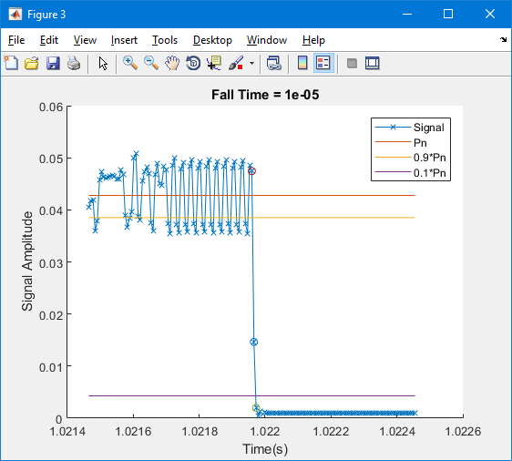{width="4.416666666666667in"
height="3.9765715223097113in"}

Carrier Frequency Estimation, Removal & Tracking
------------------------------------------------

In preparation for signal analysis, the remnants of the carrier
frequency remaining in the input data must be removed. (Figure 4
illustrates the signal in the frequency domain.) This can be
accomplished in two steps.

As the signal is modulated with an OQPSK (Offset Quadrature Phase Shift
Keying) modulation, a coarse estimation of the carrier frequency can be
obtained by an FFT (Fast Fourier Transform) followed by a peak detection
performed on the fourth power of the complex signal. The center
frequency (a scalar quantity) can then be applied to a digital
downconversion process producing a baseband complex signal. No filtering
or filtering with bandwidth much higher than the SGB bandwidth should be
applied so that the signal shape is retained.

After downconversion, the complex baseband signal should be analysed for
residual carrier frequency offset. Any carrier frequency offset (Δf)
that remains must be tracked and removed (for example, using a PLL
(Phase Lock Loop)). Figure 5 illustrates the presence of residual
carrier offset. The tracking process will produce fine frequency
measurements across the burst.

The two carrier measurements are combined together with the local
oscillator frequency used in the input sampling process, into a
composite frequency measurement that will be used to characterize the
transmit frequency section B.2.2.

### Script center\_scale.m

The coarse frequency is established by using a chip rate
delay-multiply-FFT approach. The delay multiply FFT generates two tones
that should be symmetric around DC. The frequency offset scalar that
centers the two tones is recorded and applied to the signal to remove
the bias. The positive peak after centering the spectrum represents the
aggregate chip rate of the burst, see Figure 9: Center Scale.

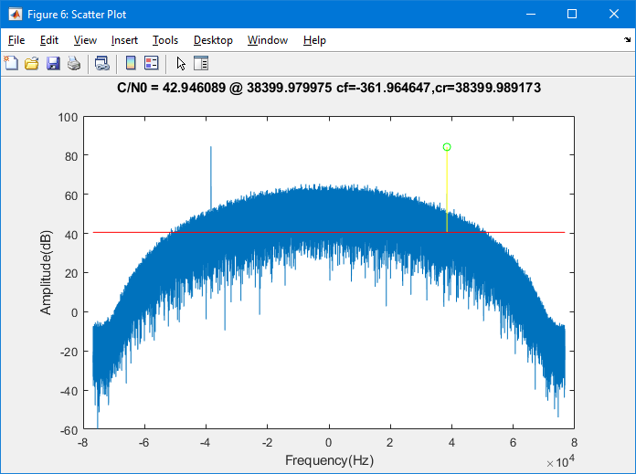{width="6.5in"
height="4.847222222222222in"}

Figure 9: Center Scale

### Script carrierphasecorrection.m

Carrier Phase Correction is the processing of phase locking to the
carrier and removing the residual carrier phase. The script
carrierphasecorrection.m uses a closed loop synchronizer optimized for
OQPSK that outputs a phase corrected burst signal. The error signal
output is the residual carrier used to determine the short-term
frequency stability, see Figure 10: Carrier Phase Correction.

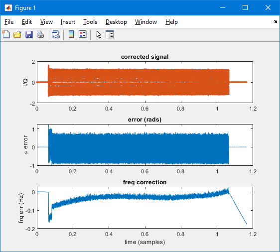{width="5.854166666666667in"
height="5.270833333333333in"}

Figure 10: Carrier Phase Correction

### Script shorttermcarrier.m

Using the output of carrierphasecorrection, the residual carrier is
analysed in windows across the burst to determine the short-term
frequency stability, see Figure 11: Short Term Carrier Analysis.

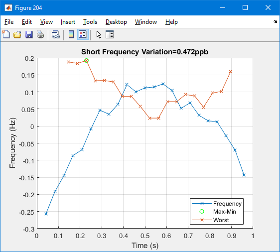{width="5.854166666666667in"
height="5.270833333333333in"}

Figure 11: Short Term Carrier Analysis

Code Tracking
-------------

Finally, a timing error detector will be used to provide chip symbol
synchronization and demodulate the I and Q chip sequences. I and Q
channel signal characteristics such as chip rate, chip rate variation,
the relative offset and amplitude can then be measured as described in
section B.3.2. Note that the time offset between I and Q channel
measurement requires coherent processing (i.e. same time reference) on
both I and Q channels.

### Script detect.m

Prior to symbol synchronization, PN synchronization is performed; a
local copy of the PN code is cross-correlated against the burst symbols
sequentially, followed by peak search. The peak determines the location
of the first sample of the first PN symbol, see Figure 11: Detection.

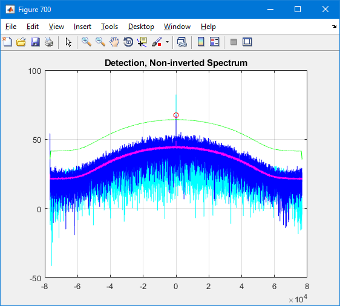{width="5.49744094488189in"
height="4.9496533245844265in"}

Figure 12: Detection

### Script symbolsync.m

A timing error detector is a closed loop resampler that corrects the
symbol timing at the chip level and selects the optimum sampling instant
for each symbol. The error corrections used to correct the timing are
recorded to be analysed.

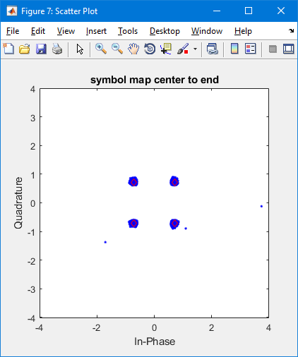{width="4.768115704286964in"
height="4.949234470691164in"}

Figure 13: Symbol Synchronization

### Script doevm.m

Using the optimized chip symbols from symbolsync, the script doevm takes
windows of symbols and calculates the evm temporally over the burst.

Figure 14: EVM over Burst time

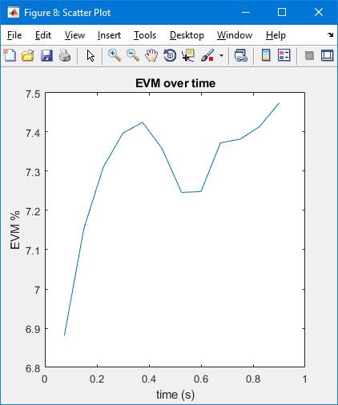{width="4.1279713473315836in"
height="4.9496533245844265in"}

### Script evalchiperror.m

Using the error corrections output of symbolsync, the temporal chip rate
error is established for the preamble and burst.

Figure 15: Chip Rate error over Message

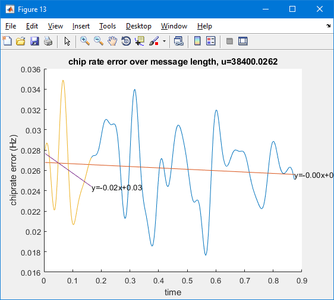{width="5.49744094488189in"
height="4.9496533245844265in"}

### Script offsetcheck.m

Using the carrierphase corrected signal, the I and Q channels are
correlated independently with their individual PN codes. The correlation
peaks for each channel are determined and interpolated to be sub-chip
accuracy; and the time difference is used to establish the offset.

Figure 16: I vs Q Offset error

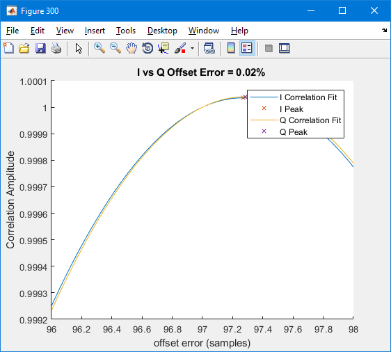{width="5.49744094488189in"
height="4.9496533245844265in"}

### Script pk2pk

Using the carrier phase corrected output, the peak to peak amplitude is
determined.

Figure 17: Amplitude Analysis

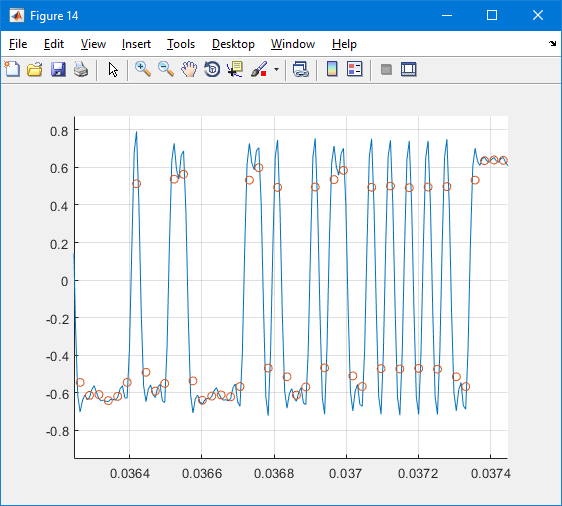{width="5.49744094488189in"
height="4.9496533245844265in"}

Bit Demodulation
----------------

A complex reference waveform made up of unmodulated PN sequences
properly offset to form the OQPSK waveform should be generated. The
beacon signal's input data samples can then be multiplied and
accumulated, or integrated, with the complex reference waveform and its
conjugate in segments of 256 symbols. The obtained complex symbols are
used to compute the EVM as described per section B.4.

This integration process de-spreads the underlying data. The complex
values of the resulting integrations are generated across the burst
creating a matrix of 150 complex pairs. The complex pairs are analyzed
to resolve the 300 message bits. The bits are then inspected for message
structure and content in sections B.6 and B.8

### Script dodemodsimple.m

After determining the first PN sample in detect.m, OQPSK demodulation is
performed to recover the underlying message bits.

### Script testpayload.m

Evaluates the payload bits for BCH errors, makes corrections and
determines bit error positions.

### Script analyzemessage.m

Parses the message bits to determine the message content. Creates a
table of message break down, see Figure 18: Table Output.

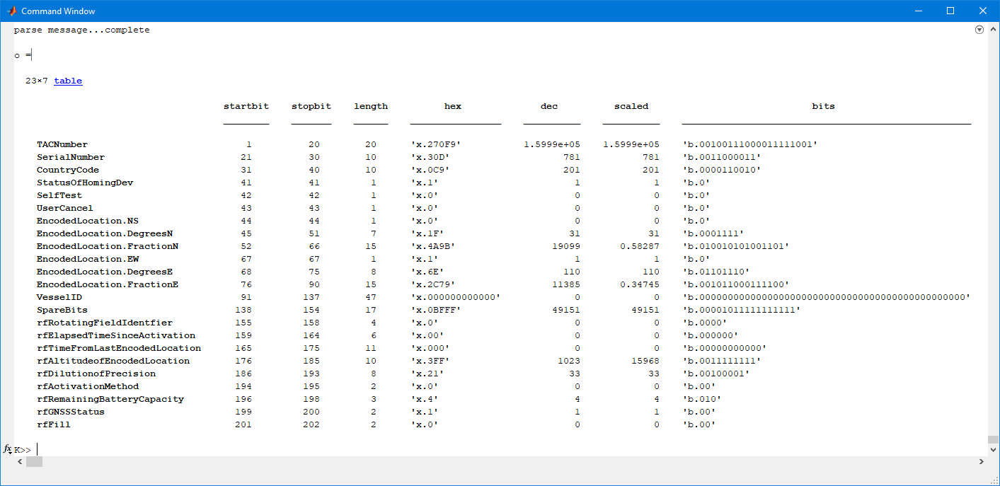{width="7.114818460192476in"
height="2.625in"}

Figure 18: Table Output

Chip Demodulation
-----------------

After the known data information is removed from the I and Q chip
sequences, the I and Q PN sequences can be verified to be correct.

### Script qpskdemod.m

The output of the symbol synchronizer is a stagger-corrected set of PN
symbols. The demodulation of the symbols can be done by simple QPSK
demod given the offset has been removed.

### Script assess\_pn.m

The output of the qpskdemod is the interleaved PN chips for the I and Q
channel that are modulated with the payload bits. The script assess\_pn
takes the PN chips and message bit payload and removes the message bit
modulation from the PN in order to compare with the local copy of the
PN. The number of errors between the I and Q channel PN code can then be
assessed.

Support Scripts
===============

The following scripts are called from the above scripts. A brief
description of each follows.

docno.m: Using the output symbols from the demod, calculate the C/No of
the signal.

messageStruct.m: Using the demodulated bits, the message structure is
parsed and output in tabular form.

sgbrcfilter.m: RRC filter to be used as matched filter for input bursts.

specpeak\_sr0.m: Spectral analysis script.

writemeasurements.m: Write the collected measurements into the xlsx file
format.

compilespecs.m: Format an xlsx spreadsheet and output measurements.

detectpn23.m: Using a sliding window, correlate the conjugated PN code
with the input burst signal and integrate the results finding detection
peaks.

dospread.m: Generate a spread spectrum signal from a set of input bits.

frequencydiscover.m: Generate carrier using 4^th^ power.

getPN23.m: Get the PN code for either Normal or Self Test Mode.

getpnbin.m: Convert PN code to vector.

getsgbid.m: Determine 15 hex beacon id from message bits.

getwfPN23\_upsamplewithdata.m: Modulate data with PN code.

matchfilter.m: Get matched filter

oqpsk\_spread.m: OQPSK spread using input PN codes and data.

peakdet.m: Find peaks in input data vector.

removesheets.m: remove sheets from xlsx file.

sgb\_bch\_encode.m: Encode bits with BCH.

specpowr\_sr2.m: Generate power profile using spectrum.

str2bin.m: Convert input string to binary vector.
